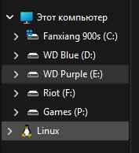

# 04 — Fish
# 📚 Содержание

1. [01 — SSH ключ](01-ssh-key.md)
2. [02 — Установка WSL](02-wsl.md)
3. [03 — WezTerm](03-wezterm.md) 
4. [04 — Fish](04-fish.md) 👈 сейчас вы здесь


## Зачем вообще Fish?

У нас уже почти всё готово, но нет:

- автодополнения команд;
- подсветки текста;
- удобной работы с историей;
- красивого prompt.

В обычном bash этого либо нет, либо надо долго настраивать.

Fish (Friendly Interactive Shell) решает эту проблему.


---

# Установка Fish

Открываем WSL Ubuntu.

Обновляем пакеты:

```bash
sudo apt update
```

Устанавливаем Fish:

```bash
sudo apt install fish -y
```

Проверяем:

```bash
fish --version
```

Если появилась версия — Fish установлен.


---

# Делаем Fish оболочкой по умолчанию

Узнаём путь до Fish:

```bash
which fish
```

Обычно:

```
/usr/bin/fish
```

Меняем оболочку:

```bash
chsh -s /usr/bin/fish
```

После этого перезапускаем WezTerm. 
Либо пишем exec fish


---

# Установка дополнительных программ

Наш конфиг использует несколько дополнительных программ.

Сначала устанавливаем их.


## Starship

Красивый prompt терминала.

```bash
sudo apt install starship -y
```


---

## zoxide

Умный переход между папками.

Например:

```bash
z project
```

вместо:

```bash
cd /длинный/путь/до/project
```

Установка:

```bash
sudo apt install zoxide -y
```


---

## fzf

Поиск по истории команд и файлам.

```bash
sudo apt install fzf -y
```
чтобы запустить: ctrl + R

---

## eza

Красивый аналог `ls`.

Добавляет:

- иконки;
- красивый вывод;
- сортировку папок.


Установка:

```bash
sudo apt install eza -y
```


---

## bat

Красивый аналог `cat`.

```bash
sudo apt install bat -y
```


---

## ripgrep

Быстрый поиск по файлам.

```bash
sudo apt install ripgrep -y
```


---

# Установка pokemon-colorscripts

Небольшая дополнительная штука для терминала.

Она просто выводит случайного покемона при запуске.


Клонируем репозиторий:

```bash
git clone https://gitlab.com/phoneybadger/pokemon-colorscripts.git
```


Переходим в папку:

```bash
cd pokemon-colorscripts
```


Устанавливаем:

```bash
sudo ./install.sh
```


Проверяем:

```bash
pokemon-colorscripts -r
```


---

# Установка Fisher

Fisher — это менеджер плагинов для Fish.

Через него можно устанавливать дополнительные расширения.

По сути сейчас он особо и не нужен. Но в дальнейшем может пригодится. Хуже не будет.

Установка:

```bash
curl -sL https://raw.githubusercontent.com/jorgebucaran/fisher/main/functions/fisher.fish | source && fisher install jorgebucaran/fisher
```


---

# Финальный шаг — готовый config.fish

Теперь всё необходимое установлено.

Осталось добавить готовую настройку.

### Из скачанного архива, в папке config - нам нужен

```bash
config.fish
````
Его нужно переместить в 
путь:

```
~/.config/fish/config.fish

где  ~  это ваша домашняя папка Linux.
Например:
/home/username
```
Также в проводнике можно заметить пингвина, если нажать на него то попадем в wsl. 



там заходим ubuntu/home/username/.config/fish/

Просто закидываем файл с заменой.

Всё.

Теперь Fish настроен.

---


# Важный момент

В конфиге есть функция:

```fish
function s21
    cd /mnt/e/Школа21
end
```

Она ведёт в мою личную папку.

У вас она работать не будет.

Нужно заменить путь на свой.

Например:

```fish
function s21
    cd /mnt/c/Users/USERNAME/Documents/S21
end
```
либо убрать её вообще.

Ну и вообще, желательно разобраться что написано в этом конфиге, чтобы в будущем суметь
самому его настраивать.

---

# Проверка

Закрываем WezTerm.

Открываем заново.

Либо можно написать:

```bash
exec fish
```


Если всё сделано правильно:

- запускается Fish;
- появляется Starship;
- работают красивые `ls`;
- работает zoxide;
- появляется pokemon.


Готово.


```bash
exec fish
```
получать нового покемона

---
Теперь у тебя красивый терминал. Можно делать хоть что
например устанавливать fastfetch, superfile, lazygit, lazyvim и другие прикольные проги, если знаете.

А и да. Иногда терминал будет ругаться с ошибкой сканера Starship. Всё нормально. Он просто ищет git файлы. 

Если пишет ошибку, значит вы не находитесь в папке связанной с git

# ⬅️ [На главную страницу](README.md)