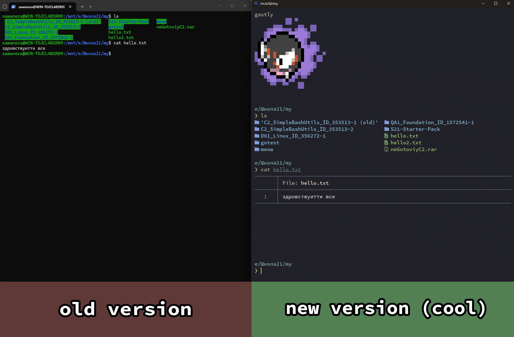

# 🚀 Турбо-гайд по настройке красивого терминала для Школы 21

## Быстрый старт
### ШАГ №1 — СКАЧАЙТЕ АРХИВ!!!!11!!1
Скачиваем весь архив и распаковываем его в удобное место.
### ШАГ №2 — Открывайте `.md` файлы через GitHub
Открываем файлы с инструкциями и идём строго по порядку.
# 📚 Содержание

1. [01 — SSH ключ](01-ssh-key.md)  👈 начинай отсюда
2. [02 — Установка WSL](02-wsl.md)
3. [03 — WezTerm](03-wezterm.md)
4. [04 — Fish](04-fish.md)

---

# Для кого этот гайд?

Этот репозиторий рассчитан на новых студентов Школы 21, которые уже прошли бассейн и перешли на основной этап обучения.

---

# Что мы сделаем?

1. Установим WSL (Linux внутри Windows).

2. Настроим SSH-ключи для GitLab:
    - один для Windows;
    - один внутри WSL.

3. Установим необходимые шрифты для терминала.

4. Установим WezTerm и настроим его через готовый конфиг.

5. Установим и настроим Fish:
    - Starship;
    - Zoxide;
    - Fzf;
    - Eza;
    - Bat;
    - Ripgrep;
    - Pokemon-colorscripts;
    - Fisher.

6. Добавим готовый конфиг Fish.

---

# В итоге получаем

После выполнения всех шагов у вас будет:

✅ Linux окружение через WSL  
✅ удобный терминал WezTerm  
✅ Fish shell вместо стандартного Bash  
✅ красивый prompt через Starship  
✅ удобные команды для работы с файлами  
✅ готовая среда для учебы в Школе 21

По сути всё.

# [НАЖИМАЙ СЮДА ЧТОБЫ НАЧАТЬ](01-ssh-key.md) 